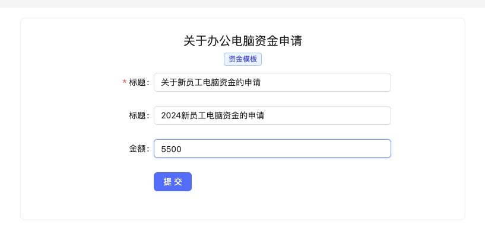
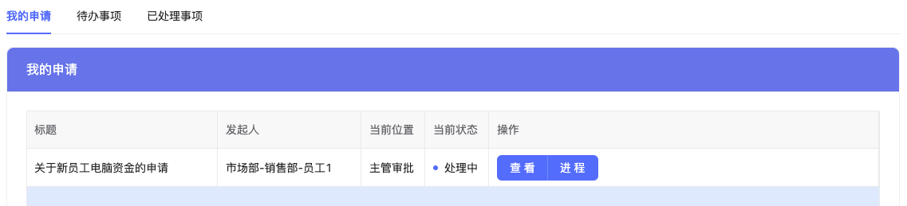
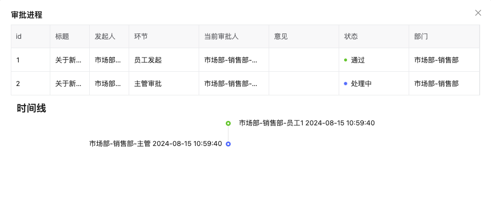
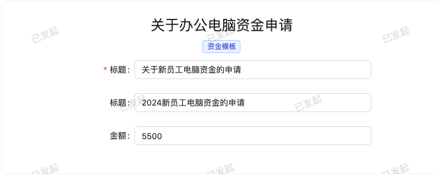
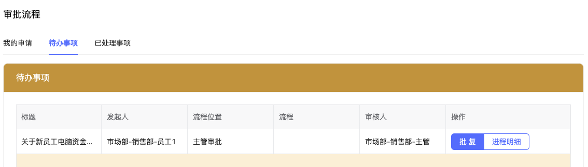
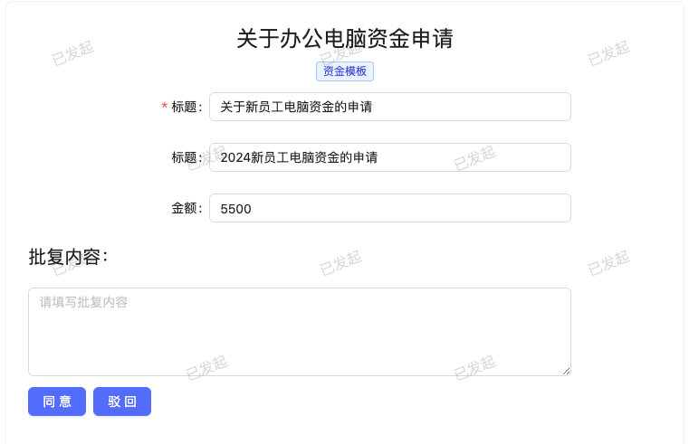

## API

流程审批框架集成了有关审批设计及审批审核的API，方便开发者快速集成到现有应用中。  
流程流转将根据前面流程设计，产生不同的流向，实现动态流转效果。  
框架中还有其他的api接口，如需了解，请查看详情[API路由](https://github.com/hulutech-web/goravel-workflow/tree/master/routes)

### 1. 基础

#### 部门相关
子部门，树形结构
```go
deptCtrl := controllers.NewDeptController()
router.Resource("dept", deptCtrl) //部门增删改查
router.Post("dept/bindmanager", deptCtrl.BindManager) //绑定部门主管
router.Post("dept/binddirector", deptCtrl.BindDirector) //绑定部门经理
```

#### 员工相关
基础信息，其中绑定用户可以根据实际情况进行修改
```go
empCtrl := controllers.NewEmpController()
router.Resource("emp", empCtrl)
router.Post("emp/search", empCtrl.Search)
router.Get("emp/options", empCtrl.Options)
router.Post("emp/bind", empCtrl.BindUser) //绑定用户
```
### 2. 流程模板&模板字段

- 模板字段，模板字段提供了基于goravel的字段设计规则，包含文本，数字，文本域，下拉框，单选框，复选框，日期，文件
- 字段验证，必填，字符串，邮箱，数字，日期，最小长度，最大长度，最大值，最小值，不等于，文件，图片，数字大于0
  
```go
//模板控件
templateformCtrl := controllers.NewTemplateformController()
router.Get("template/{id}/templateform", templateformCtrl.Index)
router.Post("templateform", templateformCtrl.Store)
router.Put("templateform/{id}", templateformCtrl.Update)
router.Delete("templateform/{id}", templateformCtrl.Destroy)
router.Get("templateform/{id}", templateformCtrl.Show)
//模板
templateCtrl := controllers.NewTemplateController()
router.Resource("template", templateCtrl)
```


### 3. 流程发起
发起流程时，将根据之前流程设计中选用的流程模板进行动态匹配提交字段，并根据字段类型，字段验证进行校验

```go
//entry节点
entryCtrl := controllers.NewEntryController()
router.Get("flow/{id}/entry", entryCtrl.Create)
router.Post("entry", entryCtrl.Store)
router.Get("entry/{id}", entryCtrl.Show)
router.Get("entry/{id}/entrydata", entryCtrl.EntryData)
```
#### 3.1 查看流程
首页控制台将看到自身已发起的流程事项


#### 3.2 查看进程
点击进程后，可以看到审核进程情况

```go
procCtrl := controllers.NewProcController()
router.Get("proc/{entry_id}", procCtrl.Index)
```
#### 3.3 查看提交表单
点击查看后，可以看到提交审批人提交的相关信息，该表单已添加水印

```go
router.Get("entry/{id}", entryCtrl.Show)
router.Get("entry/{id}/entrydata", entryCtrl.EntryData)
```

### 4. 流程处理&流转
在待办事项中可以查看到，我的待办审批信息。

```go
//	审批流转
procCtrl := controllers.NewProcController()
router.Get("proc/{entry_id}", procCtrl.Index)

```

### 5. 同意与驳回
上一步骤点击批复后，跳转到页面，填写审批意见，并进行通过或者驳回处理。

```go
procCtrl := controllers.NewProcController()
//同意
router.Post("pass", procCtrl.Pass)
//驳回
router.Post("unpass", procCtrl.UnPass)
```
