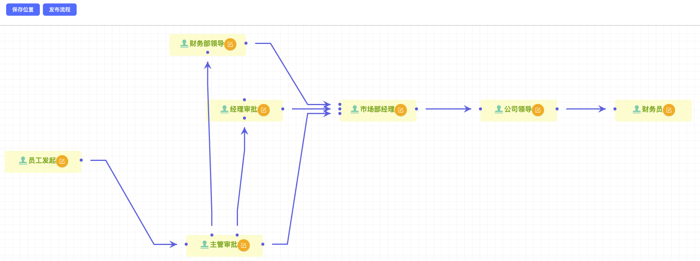

# 开始
[](https://github.com/hulutech-web/goravel-workflow)

golang语言开发， [goravel](https://goravel.dev "最易上手的golang语言web框架")框架审批流完整解决方案。

## 简介

goravel-workflow由golang语言开发，为goravel框架量身打造的一款审批流扩展应用。  
面向中小企业、组织、单位提供完善的审批工作流框架，同时提供的hooks，且提供插件开发，满足个性化需求。  

【示意图】

  

查看 [goravel-workflow](https://github.com/hulutech-web/goravel-workflow)获取更多详情。  
框架V2版本正在陆续开发中:tada:
## 前端

goravel-workflow前端采用vue开发，前端代码托管在 [https://github.com/hulutech-web/goravel-workflow-vue](https://github.com/hulutech-web/goravel-workflow-vue)


## 详情

适用场景：
- 公文审批
- 任务分发
- 工作流审批
- .....

特点：
- 与[goravel](https://goravel.dev "最易上手的golang语言web框架")框架无缝集成，适配goravel框架表单验证规则，ORM，路由，文件上传等
- 支持自定义审批节点，节点名称，节点处理人，节点显示样式，图标
- 支持自定义审批节点关系，采用可视化拖拽方式节点流转路径
- 支持自定义审批节点权限，根据提交表单信息，动态选择流转线路
- 支持自定义审批节点处理人，可配置自动选人，可手动指定部门和指定审批人
- 流程审批单自定义配置，配置字段类型，支持文本，数字，单选，多选，日期，文件，长文本
- 支持审批单字段验证，可配置，大于，小于，等于，不等于，多选，单选，必填，可配置多条规则

## 审批过程

- 发起审批
- 审批节点流转，同意，驳回
- 审批节点处理，条件判断，根据条件自动寻找合适的节点
- 审批节点反馈，审批记录，
- 审批节点结束，结束当前，或者进入子流程

## 消息通知
- 提供节点审批``同意``的hook函数（含流程完结），可自定义消息通知
- 提供审批``驳回``后的hook函数，可自定义消息通知

## 安装

```shell
go get github.com/hulutech-web/goravel-workflow
```


## 许可证

[MIT](https://opensource.org/licenses/MIT)