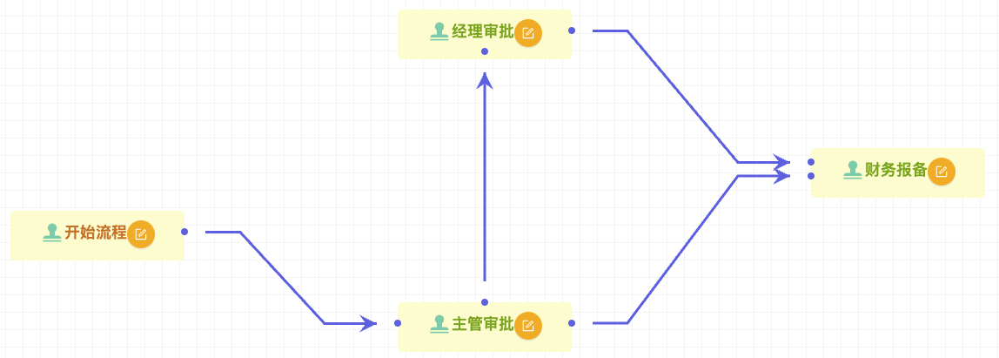

# 使用步骤

goravel-workflow由前端提供图形化页面生成执行流，[前端框架](https://github.com/hulutech-web/goravel-workflow-vue)。

### 演示

### 定义模板

#### 模板定义

    配置模板名称以提供后续直接选择使用。

#### 设计字段

    含有字段类型，字段名称，字段值，字段描述，字段是否必填，提交数据时的校验规则等。

### 创建流程

    填写流程相关配置信息，并选择模板

### 设计流程

    创建流程步骤节点，并配置相关信息：节点名称，节点样式，节点权限等信息。

    常规设置

    条件
    

    权限
    

    样式
    

### 保存发布

保存流程后，请点击发布正式发布上线使用，如遇到报错，请仔细检查各节点配置信息是否正确。

默认情况下，系统将根据权限中配置的信息进行查找具体的审批人。
- 授权部门时：查找部门主管
- 授权员工时：将自动查找该员工